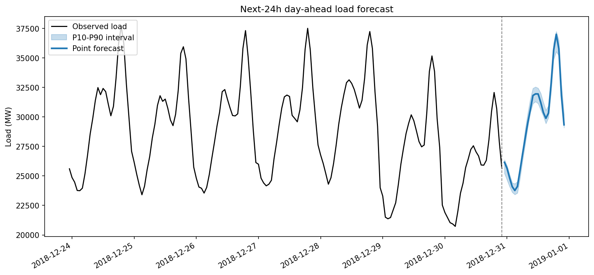
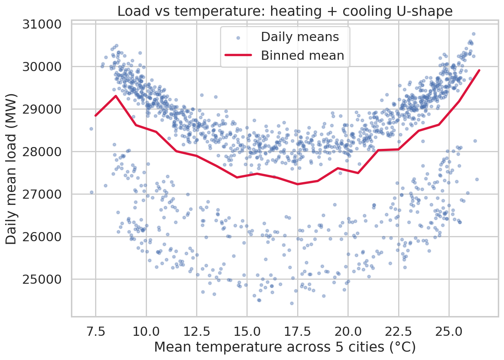
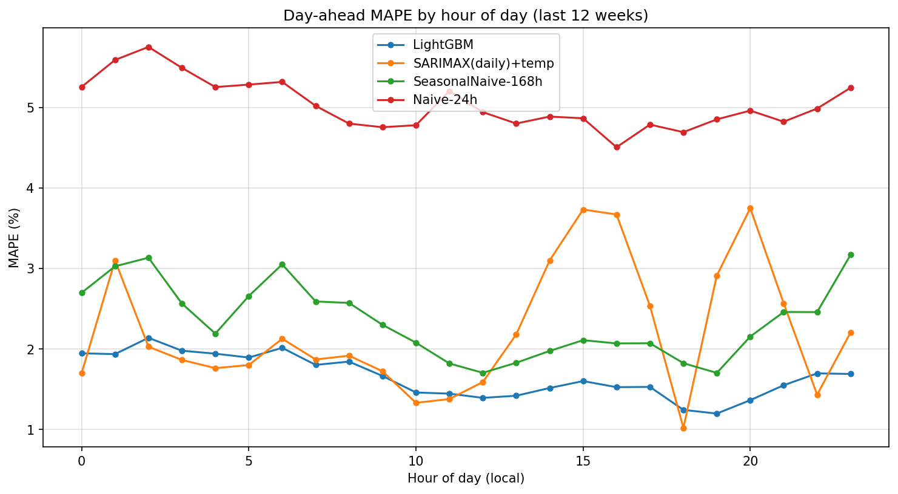
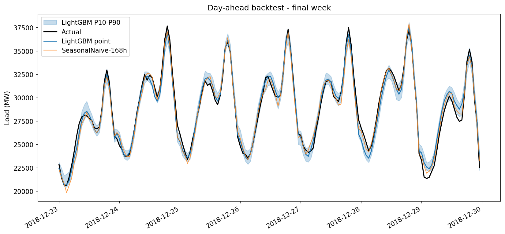

# Day-Ahead Electricity Demand Forecasting: Spain

Forecasting the next 24 hours of national electricity load from 4 years of
hourly demand and multi-city weather data, with honest baselines, a classical
statistical model, a gradient-boosting main model, prediction intervals, a
rolling-origin backtest, and a Streamlit dashboard.



## Why this problem matters

Day-ahead load forecasts drive the daily power procurement cycle: utilities and
grid operators bid volumes into the day-ahead market based on these numbers.
Buy too little and the shortfall must be covered at volatile intraday/balancing
prices; buy too much and the surplus is sold back at a loss. Because the
volumes are enormous (Spanish demand averages ~28-29 GW), **even a ~1%
reduction in MAPE translates into materially lower imbalance and procurement
costs**, which is why utilities keep dedicated teams on this exact problem.
Point forecasts alone are not enough: procurement is a decision under
uncertainty, so this project also produces **P10-P90 prediction intervals**.

## Data

Kaggle: [Hourly energy demand generation and weather](https://www.kaggle.com/datasets/nicholasjhana/energy-consumption-generation-prices-and-weather)
(nicholasjhana), Spain, 2015-2018, hourly.

| File | Contents | Used here |
|---|---|---|
| `energy_dataset.csv` | national load, generation mix, prices (ENTSO-E) | target: **`total load actual`** |
| `weather_features.csv` | weather for Valencia, Madrid, Bilbao, Barcelona, Seville (OpenWeather) | temperature (+ humidity, wind, pressure, clouds), averaged across the 5 cities |

Cleaning (in `src/data_ingestion.py`): tz-aware timestamps parsed to UTC,
duplicate rows dropped (the weather file contains thousands of duplicated
(city, hour) rows), the series re-indexed to a complete hourly range, gaps of
≤ 24 h time-interpolated, Kelvin → °C, whitespace-polluted city names fixed.
Exact counts for the data you run on are written to `reports/data_quality.json`.

## Methodology

```
raw CSVs ─► ingestion/cleaning ─► EDA ─► feature engineering ─► models ─► rolling-origin backtest ─► next-24h forecast + app
            src/data_ingestion    src/eda    src/features       src/models   src/evaluate              src/forecast, app.py
```

**Task definition.** At the end of day *D*, predict all 24 hours of day *D+1*
(the day-ahead market timeline). Every feature is constrained to information
available at the origin: all lag/rolling features are shifted ≥ 24 h, making
LightGBM a *direct* day-ahead forecaster with no leakage and no recursive
error accumulation.

**Features** (`src/features.py`): calendar in local time: hour, weekday,
month, weekend, **Spanish public holidays** (`holidays` package), cyclical
sin/cos encodings; load lags (24 h, 48 h, 168 h); day-ahead-safe rolling mean
(24 h, 168 h) and std (24 h); city-averaged temperature and **temperature²**
(the EDA shows the classic U-shape: electric heating below ~15 °C,
air-conditioning above ~22 °C).



**Models** (`src/models/`):

| Model | Role |
|---|---|
| Naive-24h (yesterday) | mandatory benchmark |
| Seasonal naive-168h (last week) | mandatory benchmark |
| SARIMAX on daily means, weekly seasonality, exogenous `temp` + centred `temp²` | classical statistical reference; order selected by AIC over a (p,1,q)×(P,D,Q)₇ grid; ranked table in `reports/sarimax_order_selection.csv`; daily forecasts disaggregated to hourly via the train-period hour-of-week profile |
| **LightGBM** on hourly data, full feature set | **main model** |
| LightGBM quantile (pinball loss, α = 0.10/0.50/0.90) | P10-P90 prediction intervals |

**Evaluation protocol** (`src/evaluate.py`): rolling-origin day-ahead backtest
over the **final 12 weeks** (~2,000 hourly forecasts). The origin advances one
day at a time; LightGBM is refit weekly, SARIMAX absorbs each observed day via
its Kalman filter (full refit every 4 weeks). Metrics: MAPE, RMSE, MAE,
overall and per hour of day. The top two models are compared with a
**Diebold-Mariano test** (squared-error loss, Newey-West variance at h = 24,
Harvey-Leybourne-Newbold small-sample correction).

## Results

<!-- Regenerate after running the pipeline on the Kaggle data: python -m src.evaluate, then paste reports/results.md below. -->

Rolling-origin day-ahead backtest, final 12 weeks (2,016 hourly forecasts):

| Model | MAPE (%) | RMSE (MW) | MAE (MW) |
|:---|---:|---:|---:|
| **LightGBM** | **1.66** | **570.6** | **454.4** |
| SARIMAX(daily)+temp | 2.22 | 821.6 | 630.4 |
| SeasonalNaive-168h | 2.34 | 866.5 | 644.7 |
| Naive-24h | 5.04 | 1863.7 | 1385.1 |

**Diebold-Mariano** (LightGBM vs SARIMAX, squared-error loss, h = 24,
HLN-adjusted): statistic = **-6.09**, p-value = **1.3 × 10⁻⁹**, LightGBM's
advantage over the best non-ML alternative is statistically significant, not
backtest luck.

**Prediction intervals:** LightGBM P10-P90 empirical coverage **71%**
(nominal 80%), slightly over-confident, a known trait of quantile GBMs and an
honest limitation (conformal calibration is a listed next step).

Per-hour errors show the pattern typical of load forecasting: evening-peak and
ramp hours are hardest, night hours easiest:





## Repository structure

```
energy-demand-forecasting/
├── data/raw/                  # place the two Kaggle CSVs here (gitignored)
├── data/processed/            # pipeline output (gitignored)
├── notebooks/
│   ├── 01_eda.ipynb           # narrative EDA
│   └── 02_modeling.ipynb      # narrative modelling walkthrough
├── src/
│   ├── config.py              # paths + constants
│   ├── data_ingestion.py      # cleaning, merge, optional Kaggle API download
│   ├── synthetic_data.py      # schema-exact sample generator (testing only)
│   ├── eda.py                 # all EDA figures
│   ├── features.py            # calendar/holiday/lag/rolling/weather features
│   ├── models/
│   │   ├── baselines.py       # naive-24h, seasonal naive-168h
│   │   ├── sarimax_model.py   # AIC order selection, fit, disaggregation
│   │   └── lgbm_model.py      # point + quantile models
│   ├── evaluate.py            # rolling-origin backtest, DM test
│   └── forecast.py            # next-24h forecast with P10-P90 band
├── app.py                     # Streamlit dashboard
├── reports/                   # metrics, results.md, data_quality.json
│   └── figures/               # all plots
├── requirements.txt
└── README.md
```

## How to run

```bash
# 1. environment (Python 3.10 to 3.12)
python -m venv .venv && source .venv/bin/activate
pip install -r requirements.txt

# 2. data: either place the two Kaggle CSVs in data/raw/, or configure
#    Kaggle API credentials (~/.kaggle/kaggle.json) and let step 3 download.
#    (For a quick smoke test without the real data: python -m src.synthetic_data)

# 3. pipeline (each script also runs standalone)
python -m src.data_ingestion
python -m src.eda
python -m src.features
python -m src.models.sarimax_model     # AIC order selection report
python -m src.models.lgbm_model        # train + persist models
python -m src.evaluate                 # 12-week rolling-origin backtest (a few minutes)
python -m src.forecast                 # next-24h forecast + band

# 4. dashboard
streamlit run app.py
```

## Limitations & next steps

* **Holiday interactions.** Holidays enter as a single flag; bridge days and
  holiday×hour interaction effects (a holiday reshapes the whole intraday
  profile) are not modelled.
* **Weather is assumed known.** Day-ahead forecasts use observed weather at
  target time (persistence in `src/forecast.py`); a production system would
  consume numerical weather predictions, adding their own error.
* **Single country, single series.** National aggregate only, no regional
  decomposition, and conclusions may not transfer to other grids.
* **Pre-COVID data.** 2015-2018 excludes the structural demand shifts of
  2020+; the model would need retraining and drift monitoring in production.
* **Natural extensions:** holiday-profile features, weather-forecast inputs,
  conformalized intervals, hyperparameter search, and a scheduled retraining
  job with monitoring.
